# Lambda Deployment Guide

## Overview

This project uses **GitHub Actions** for automated Lambda deployments to both development and production environments.

---

## 🚀 Deployment Workflows

### 1. **Development (Automatic)**
- **Trigger**: Every push to `master` branch with changes in `Lambda/` directory
- **Workflow**: `.github/workflows/deploy-lambdas-dev.yml`
- **Process**:
  1. Build and deploy `podcasto-shared-layer-dev`
  2. Update all dev Lambda functions with new layer version
  3. Verify deployment health

### 2. **Production (Manual)**
- **Trigger**: Manual dispatch through GitHub Actions UI
- **Workflow**: `.github/workflows/deploy-lambdas-prod.yml`
- **Process**:
  1. Requires typing "DEPLOY TO PRODUCTION" for confirmation
  2. Build and deploy `podcasto-shared-layer-prod`
  3. Update all prod Lambda functions with new layer version
  4. Verify deployment health
  5. **fail-fast**: Stops immediately if any Lambda fails

---

## ⚙️ Required GitHub Secrets

Navigate to: **Repository Settings → Secrets and variables → Actions → New repository secret**

### Required Secrets:

| Secret Name | Description | Where to get it |
|------------|-------------|-----------------|
| `AWS_ACCESS_KEY_ID` | AWS IAM access key ID | AWS IAM Console |
| `AWS_SECRET_ACCESS_KEY` | AWS IAM secret access key | AWS IAM Console |

### Optional (if needed in future):
| Secret Name | Description |
|------------|-------------|
| `GEMINI_API_KEY` | Google Gemini API key (stored in AWS Secrets Manager) |
| `SUPABASE_SERVICE_KEY` | Supabase service role key (stored in AWS Secrets Manager) |

---

## 📋 IAM Permissions Required

The AWS user for GitHub Actions needs these permissions:

```json
{
  "Version": "2012-10-17",
  "Statement": [
    {
      "Effect": "Allow",
      "Action": [
        "cloudformation:*",
        "lambda:*",
        "s3:*",
        "iam:GetRole",
        "iam:PassRole"
      ],
      "Resource": "*"
    }
  ]
}
```

---

## 🔄 How Deployments Work

### Development Deployment Flow:

```mermaid
graph LR
    A[Push to master] --> B{Changes in Lambda/?}
    B -->|Yes| C[Build shared-layer]
    B -->|No| Z[Skip deployment]
    C --> D[Deploy layer to dev]
    D --> E[Get new layer ARN]
    E --> F[Update audio-generation-dev]
    E --> G[Update script-preprocessor-dev]
    F --> H[Verify health]
    G --> H
    H --> I[✅ Deployment complete]
```



### Production Deployment Flow:

```
1. Go to GitHub Actions tab
2. Select "Deploy Lambdas to Production" workflow
3. Click "Run workflow"
4. Type: "DEPLOY TO PRODUCTION"
5. Click "Run workflow" button
6. Monitor deployment progress
```

---

## 🛠️ Manual Deployment (Fallback)

If GitHub Actions is unavailable, you can still deploy manually:

### Deploy Shared Layer:
```bash
cd Lambda/shared-layer
sam build
sam deploy --stack-name podcasto-shared-layer-dev \
  --no-confirm-changeset \
  --parameter-overrides "Environment=dev" \
  --capabilities CAPABILITY_IAM \
  --resolve-s3
```

### Update Lambdas:
```bash
# Get new layer ARN
LAYER_ARN=$(aws cloudformation describe-stacks \
  --stack-name podcasto-shared-layer-dev \
  --query 'Stacks[0].Outputs[?OutputKey==`SharedLayerArn`].OutputValue' \
  --output text)

# Update Lambda functions
aws lambda update-function-configuration \
  --function-name podcasto-audio-generation-dev \
  --layers $LAYER_ARN

aws lambda update-function-configuration \
  --function-name podcasto-script-preprocessor-dev \
  --layers $LAYER_ARN
```

---

## 📊 Monitoring Deployments

### GitHub Actions UI:
- Navigate to **Actions** tab in GitHub repository
- View workflow runs and logs
- Download logs for debugging

### AWS Console:
- CloudFormation → Stacks → `podcasto-shared-layer-{env}`
- Lambda → Functions → Check layer version and status

### CLI Verification:
```bash
# Check Lambda configuration
aws lambda get-function-configuration \
  --function-name podcasto-audio-generation-dev

# View CloudFormation stack outputs
aws cloudformation describe-stacks \
  --stack-name podcasto-shared-layer-dev
```

---

## 🔍 Troubleshooting

### Workflow fails with "No changes to deploy"
- **Cause**: SAM detects no changes in code
- **Solution**: Normal behavior, no action needed

### Lambda update fails with timeout
- **Cause**: Lambda is still processing previous update
- **Solution**: Wait 2-3 minutes and retry

### "Access Denied" errors
- **Cause**: Missing IAM permissions
- **Solution**: Verify IAM policy includes required actions

### Layer version mismatch
- **Cause**: Workflow interrupted before updating Lambdas
- **Solution**: Re-run the workflow or manually update with latest layer ARN

---

## 🎯 Best Practices

1. **Always test in dev first**: Production workflow is manual for a reason
2. **Monitor CloudWatch logs**: Check for runtime errors after deployment
3. **Use semantic commit messages**: Helps track which changes caused issues
4. **Keep secrets secure**: Never commit AWS credentials to git
5. **Review workflow logs**: Check for warnings even if deployment succeeds

---

## 📝 Notes

- **Python Runtime**: All Lambda functions use Python 3.12 for optimal performance and longer support lifecycle
- **Automatic deployment to dev** happens on every push to `master`
- **Production deployment** requires manual trigger + confirmation
- **Path filters** prevent unnecessary deployments (only triggers if Lambda/ changes)
- **Parallel Lambda updates** speed up deployment time
- **Health verification** ensures Lambdas are Active and LastUpdateStatus is Successful

---

## 🔗 Useful Links

- [AWS SAM CLI Documentation](https://docs.aws.amazon.com/serverless-application-model/latest/developerguide/what-is-sam.html)
- [GitHub Actions Documentation](https://docs.github.com/en/actions)
- [AWS Lambda Best Practices](https://docs.aws.amazon.com/lambda/latest/dg/best-practices.html)
