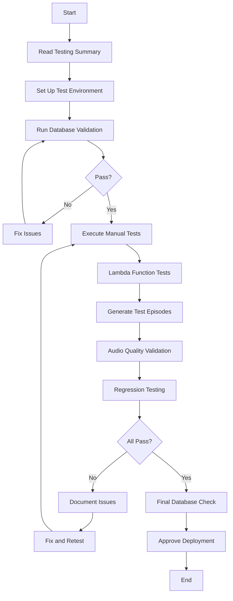

# Testing Documentation - Single-Speaker Feature

**Last Updated**: 2025-10-28
**Feature Version**: 1.0
**Testing Phase**: Phase 4.1

---

## Overview

This directory contains comprehensive testing documentation for the single-speaker podcast feature. The feature allows podcasts to be generated with a single narrator voice (monologue format) as an alternative to the existing multi-speaker dialogue format.

---

## Directory Contents

### 📋 [TESTING_SUMMARY.md](./TESTING_SUMMARY.md)
**Start here** - Executive overview of the entire testing strategy.

**What's Inside**:
- Feature overview and implementation phases
- Testing approach and philosophy
- Summary of all test deliverables
- Test execution plan (5 phases)
- Success criteria and quality metrics
- Risk assessment
- Recommendations

**When to Use**:
- Project managers wanting high-level overview
- New team members getting oriented
- Planning test execution schedule
- Reporting to stakeholders

---

### 📝 [SINGLE_SPEAKER_TEST_PLAN.md](./SINGLE_SPEAKER_TEST_PLAN.md)
Comprehensive manual test plan with 19 detailed test cases.

**What's Inside**:
- Test environment setup instructions
- Frontend testing (5 test cases)
- Backend testing (2 test cases)
- Lambda function testing (5 test cases)
- End-to-end testing (3 test cases)
- Regression testing (3 test cases)
- Database migration verification
- Test results documentation templates
- Bug report template

**When to Use**:
- Manual testing execution
- QA validation before deployment
- Regression testing
- Training new testers
- Creating test reports

**Estimated Time**: 5-7 days for complete execution

---

### 🗄️ [database_validation.sql](./database_validation.sql)
Production-ready SQL queries for database validation (40+ queries).

**What's Inside**:
- 12 validation sections
- Schema validation queries
- Data integrity checks
- Single-speaker validation
- Multi-speaker validation
- Episode validation
- Migration verification
- Processing logs analysis
- Performance metrics
- Comprehensive health check query

**When to Use**:
- Pre-deployment validation
- Post-deployment verification
- Daily/weekly health checks
- Troubleshooting data issues
- Performance monitoring

**Usage**:
```bash
# Run in your SQL client connected to database
# Start with Section 1 (Schema Validation)
# End with Section 12 (Summary Report)
```

---

### 🎵 [AUDIO_QUALITY_CHECKLIST.md](./AUDIO_QUALITY_CHECKLIST.md)
Systematic audio quality evaluation checklist (50+ checkpoints).

**What's Inside**:
- Pre-listening setup
- Single-speaker validation (29 checkpoints)
  - Voice consistency
  - TTS markup respect
  - Technical quality
  - Content quality
  - Source fidelity
- Multi-speaker validation (9 checkpoints)
- Comparative analysis
- Overall assessment
- Issue documentation
- Scoring system
- Quality benchmarks

**When to Use**:
- Validating generated audio episodes
- Quality assurance testing
- Comparing format quality
- Troubleshooting audio issues
- Establishing quality baselines

**Estimated Time**: 15-20 minutes per episode

---

### 🧪 [INTEGRATION_TESTS.md](./INTEGRATION_TESTS.md)
Automated testing recommendations and code examples.

**What's Inside**:
- Frontend integration tests (Vitest + React Testing Library)
- Backend integration tests (Vitest)
- Lambda function tests (pytest)
- End-to-end tests (Playwright)
- Test framework setup
- 8 test suites with 30+ examples
- CI/CD integration (GitHub Actions)
- Test data setup scripts
- Coverage goals and metrics

**When to Use**:
- Implementing automated tests
- Setting up CI/CD pipeline
- Code review for test quality
- Expanding test coverage
- Long-term maintenance

**Estimated Implementation Time**: 3-5 days

---

## Quick Start Guide

### For Immediate Testing (Manual)

**Day 1: Setup and Database Validation**
1. Read [TESTING_SUMMARY.md](./TESTING_SUMMARY.md) (20 min)
2. Set up test environment (see test plan section 1)
3. Run database validation queries from [database_validation.sql](./database_validation.sql)
   - Sections 1-3: Schema and integrity
   - Document any issues

**Day 2-3: Frontend and Backend Testing**
4. Execute test cases TC-1 to TC-7 from [SINGLE_SPEAKER_TEST_PLAN.md](./SINGLE_SPEAKER_TEST_PLAN.md)
5. Document results in test log

**Day 4-5: Lambda and E2E Testing**
6. Execute test cases TC-8 to TC-14
7. Generate test episodes (both formats)
8. Use [AUDIO_QUALITY_CHECKLIST.md](./AUDIO_QUALITY_CHECKLIST.md) to validate audio

**Day 6: Regression Testing**
9. Execute test cases TC-17 to TC-19
10. Run database consistency checks (SQL sections 9-11)

**Day 7: Final Validation**
11. Run database summary report (SQL section 12)
12. Review all test results
13. Create bug reports for any failures
14. Approve or reject for deployment

---

### For Long-Term Testing (Automated)

**Week 1: Test Infrastructure**
1. Review [INTEGRATION_TESTS.md](./INTEGRATION_TESTS.md)
2. Set up test frameworks (Vitest, pytest, Playwright)
3. Configure CI/CD pipeline

**Week 2: Implement Tests**
4. Implement frontend tests (Test Suites 1-3)
5. Implement backend tests (Test Suites 4-5)
6. Implement Lambda tests (Test Suites 6-7)

**Week 3: E2E and CI/CD**
7. Implement E2E tests (Test Suite 8)
8. Configure GitHub Actions workflow
9. Set up test data seeding

**Ongoing: Maintenance**
10. Run automated tests on every PR
11. Monitor test coverage
12. Update tests as features evolve

---

## Test Execution Workflow



---

## Success Criteria Summary

### Critical (Must Pass)
- ✅ All database integrity checks return 0 inconsistencies
- ✅ Format selector UI functional
- ✅ Validation prevents invalid configs
- ✅ Single-speaker uses one voice only
- ✅ Multi-speaker uses two voices
- ✅ No pipeline errors

### Quality Targets
- ✅ Audio quality ≥85%
- ✅ Episode success rate ≥95%
- ✅ Voice consistency 100% (single-speaker)
- ✅ Processing time ±10% variance
- ✅ Test coverage ≥80%

---

## Tools and Requirements

### Required Access
- Admin UI (`/admin/podcasts`)
- Database (Supabase) - read/write access
- AWS Console (Lambda, SQS, CloudWatch, S3)
- Test Telegram channel with content

### Required Tools
- SQL client (for database queries)
- Audio player (for quality checks)
- Web browser with dev tools
- Optional: AWS CLI, Postman/Insomnia

### Test Data
- Minimum 2 test podcasts (single + multi-speaker)
- Test Telegram channel with 20+ messages
- Admin user account

---

## Reporting Issues

### Bug Report Template
See [SINGLE_SPEAKER_TEST_PLAN.md](./SINGLE_SPEAKER_TEST_PLAN.md) Section "Bug Report Template"

### Issue Tracking
- **GitHub Issues**: Create issues with label `testing` and `single-speaker`
- **Slack**: #podcasto-testing channel
- **Email**: dev@podcasto.com

### Required Information
1. Test case number (e.g., TC-8)
2. Environment (dev/staging/prod)
3. Steps to reproduce
4. Expected vs actual behavior
5. Evidence (screenshots, logs, query results)
6. Severity (Critical/High/Medium/Low)

---

## Continuous Monitoring

### Daily Checks (Production)
```sql
-- Run this daily for first 2 weeks post-deployment
-- From database_validation.sql, Section 12
SELECT * FROM validation_summary_report;
```

### Weekly Checks
1. Episode success rates by format
2. Audio quality spot checks (2-3 episodes)
3. Processing time trends
4. Error rate monitoring

### Monthly Checks
1. Full database validation suite
2. Audio quality audit (10+ episodes)
3. Feature adoption metrics
4. User feedback review

---

## Additional Resources

### Related Documentation
- Feature Implementation: `/ProjectDocs/Build_Notes/active/`
- Database Schema: `/ProjectDocs/contexts/databaseSchema.md`
- Project Context: `/ProjectDocs/contexts/projectContext.md`
- API Documentation: `/docs/api/` (if exists)

### Lambda Function Code
- Script Generator: `/Lambda/script-preprocessor-lambda/src/services/gemini_script_generator.py`
- Audio Generator: `/Lambda/audio-generation-lambda/src/handlers/audio_generation_handler.py`
- Test Pipeline: `/Lambda/scripts/test_single_speaker_pipeline.py`

### Frontend Components
- Format Selector: `/podcasto/src/components/admin/podcast-form/format-selector.tsx`
- Style & Roles Fields: `/podcasto/src/components/admin/podcast-form/style-roles-fields.tsx`

---

## Version History

| Version | Date | Changes | Author |
|---------|------|---------|--------|
| 1.0 | 2025-10-28 | Initial comprehensive testing suite | Testing Team |

---

## FAQ

**Q: Which document should I start with?**
A: Start with [TESTING_SUMMARY.md](./TESTING_SUMMARY.md) for overview, then [SINGLE_SPEAKER_TEST_PLAN.md](./SINGLE_SPEAKER_TEST_PLAN.md) for execution.

**Q: How long does manual testing take?**
A: Complete manual testing takes 5-7 days. Priority tests (TC-1 to TC-7, TC-13) can be done in 2-3 days.

**Q: Can I run tests in parallel?**
A: Yes! Database validation, frontend tests, and documentation review can be done in parallel by different team members.

**Q: What if I find a critical bug?**
A: Use the bug report template in the test plan, mark severity as "Critical", and immediately notify the development lead.

**Q: Do I need to implement all automated tests?**
A: No. Automated tests are recommended for long-term maintenance but not required for initial deployment. Manual testing is sufficient for launch.

**Q: How often should I run database validation queries?**
A: Daily for the first week post-deployment, then weekly for the first month, then monthly ongoing.

**Q: What's the minimum acceptable audio quality score?**
A: 70% is minimum acceptable, 85% is target, 95% is premium quality.

**Q: Can I test in production?**
A: Only non-destructive tests (read-only queries, audio playback). Never run DELETE or UPDATE queries without explicit approval.

**Q: What if multi-speaker episodes break?**
A: This is a critical regression issue. Immediately halt deployment and report using bug template with "Critical" severity.

**Q: How do I know which voice should be used?**
A: Check CloudWatch logs for voice selection. Single-speaker should log one voice ID, multi-speaker should log two.

---

## Support

**For Testing Questions**:
- Testing Lead: [Contact Info]
- QA Team: qa@podcasto.com
- Slack: #podcasto-testing

**For Technical Issues**:
- Development Lead: [Contact Info]
- Dev Team: dev@podcasto.com
- Slack: #podcasto-dev

**For Feature Questions**:
- Product Owner: [Contact Info]
- Product Team: product@podcasto.com

---

## License

Internal documentation - Podcasto © 2025

---

**Last Updated**: 2025-10-28 by Testing Team
**Next Review**: 2025-11-28 (1 month post-deployment)
